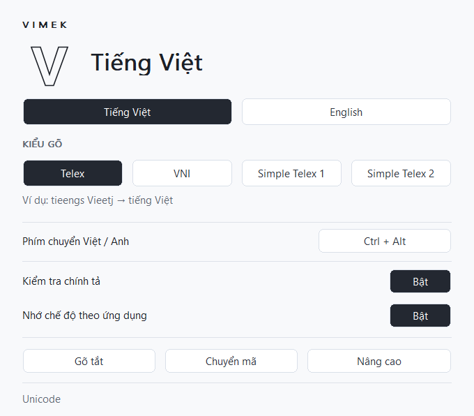

# VIMEK

[English](README.md) | **Tiếng Việt**

Bộ gõ tiếng Việt mã nguồn mở cho Windows và macOS, được phát triển bởi
[GrazT](https://github.com/dinhgia2106). VIMEK có giao diện gọn nhẹ,
tự theo chế độ sáng/tối của hệ điều hành và thao tác chuyển Việt/Anh thuận tiện.

> VIMEK đang ở giai đoạn alpha. Phản hồi và đóng góp luôn được chào đón.



## Tính năng

- Telex, VNI, Simple Telex 1 và Simple Telex 2.
- Unicode và các bảng mã tiếng Việt thông dụng.
- Chuyển Việt/Anh bằng phím tắt hoặc biểu tượng V/E ở khay hệ thống.
- Âm thanh hệ thống khi chuyển chế độ; có thể tắt trong **Nâng cao**.
- Kiểm tra chính tả, gõ tắt và nhớ chế độ gõ theo ứng dụng.
- Công cụ chuyển mã văn bản và tùy chọn khởi động cùng hệ điều hành.
- Giao diện tự chuyển sáng/tối, hỗ trợ màn hình DPI cao và Retina.

## Tải về

Tải bản build tại [GitHub Releases](https://github.com/dinhgia2106/VIMEK/releases).

- **Windows:** chọn x64 hoặc x86, giải nén ZIP và chạy VIMEK.
- **macOS:** bản universal hỗ trợ Intel và Apple Silicon từ macOS 11 trở lên. Giải nén ZIP và đưa VIMEK vào **Applications**.

Các bản Windows alpha hiện chưa có chữ ký số. Bản macOS được ký ad-hoc,
chưa được notarize bằng Apple Developer ID.

## Sử dụng

Mở VIMEK và chọn kiểu gõ trong bảng điều khiển hoặc menu khay hệ thống.
Biểu tượng **V** là chế độ tiếng Việt, **E** là chế độ tiếng Anh.
Để tránh xung đột, tắt các bộ gõ khác và chọn bàn phím **ENG** trên Windows
hoặc **ABC/U.S.** trên macOS.

Phím chuyển mặc định là **Ctrl+Alt** trên Windows, **Control+Option** trên macOS.
Giữ Ctrl/Control, bấm rồi thả Alt/Option để chuyển; có thể bấm nhiều lần
khi vẫn giữ Ctrl/Control. Thay đổi phím tắt hoặc tắt âm thanh tại **Nâng cao**.

| Kiểu gõ | Gõ | Kết quả |
| --- | --- | --- |
| Telex | `Tooi yeeu tieengs Vieetj` | Tôi yêu tiếng Việt |
| VNI | `tie6ng1 Vie6t5` | tiếng Việt |

Trên macOS, cấp quyền **Accessibility** trong **System Settings → Privacy & Security**
khi ứng dụng yêu cầu, sau đó mở lại VIMEK.

## Build từ mã nguồn

### Windows

Dùng Visual Studio 2022 trở lên với workload **Desktop development with C++** và CMake:

```powershell
cmake -S . -B build/vs -A x64
cmake --build build/vs --config Release
ctest --test-dir build/vs -C Release --output-on-failure
```

Đầu ra: `build/vs/Release/VIMEK.exe`.
Bạn cũng có thể mở `Sources/VIMEK/windows/VIMEK.sln` trong Visual Studio.

Với [LLVM-MinGW UCRT](https://github.com/mstorsjo/llvm-mingw/releases),
giải nén toolchain vào `.tools/` hoặc truyền đường dẫn thư mục `bin`:

```powershell
./scripts/build-windows.ps1
./scripts/build-windows.ps1 -Toolchain C:/llvm-mingw/bin
./scripts/build-windows.ps1 -TestsOnly
```

Đầu ra mặc định là `dist/x64/VIMEK64.exe`. Thêm `-Platform x86` để build bản 32-bit.
Đóng VIMEK đang chạy trước khi build vào cùng thư mục.

### macOS

Cần macOS 11 trở lên và Xcode với Command Line Tools:

```bash
bash scripts/build-macos.sh
```

Đầu ra là `dist/macos/VIMEK.app`, hỗ trợ Intel và Apple Silicon.
Xem [hướng dẫn macOS](macOS_Build.md) để biết thêm về cài đặt và ký ứng dụng.

## Đóng góp

Báo lỗi, đề xuất tính năng và pull request đều được chào đón.
Xem [CONTRIBUTING.md](CONTRIBUTING.md) để bắt đầu.

## Tác giả và giấy phép

VIMEK được phát triển và duy trì bởi **GrazT**.
Dự án sử dụng giấy phép [GNU GPL v3](LICENSE) và kế thừa mã nguồn
[OpenKey](https://github.com/tuyenvm/OpenKey) của Mai Vũ Tuyên.
Ghi nhận bản quyền và thành phần bên thứ ba tại [NOTICE.md](NOTICE.md).
